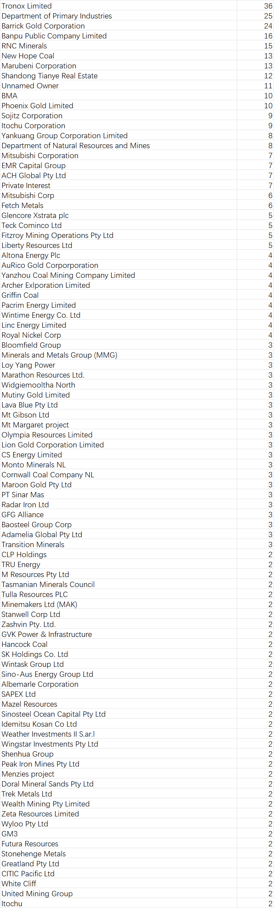

# Project Backlog (Client Preview)

This document summarizes known gaps and suggested improvements before productionization.

## Data Integrity

### Company-level data
1. Missing companies in graph (affects project→company mapping)
   - As shown in the unmatched company occurrences list, some companies do not exist in the database, so linked projects cannot be mapped to them. A common reason is that these companies are not captured under Mining categories in GICS/ICB/BICS. Manual curation is recommended.
   - Illustration (Name and Occurences in Project dataset):
- 
1. Incomplete corporate hierarchy (parent/child, M&A)
   - Current name-based entity resolution only catches name-similar parent/child relations. M&A events and complex subsidiary variations are not reliably reflected, so Company OWNS Project may be stale or incomplete.
2. Incomplete normalization of special company variants and JV notation
   - Many non-standard variants and JV-style descriptions remain; projects can be mapped to the wrong company. Example: BMA should map to BHP and Mitsubishi.
3. Company description field not fully populated
   - Useful text signals may exist but are currently missing.

### Project-level data
1. Name ambiguity across deposit/project/site
   - Geoscience Australia datasets do not clearly separate sites vs. projects vs. deposits, leading to name entities mapping to multiple potential projects.
2. ENO as a de-duplication key is unreliable
   - In practice, different ENOs can refer to different pits/sites/deposits under one project, and the DB lacks a hierarchy to represent this. This causes inaccuracies in reserve/production aggregation at project level when using ENO as an unique identifier.
3. Recommendation for higher-fidelity sources
   - For maximum accuracy, reconstruct the project layer from finer-grained state databases and reconcile into a project–site–deposit hierarchy.

## Similarity Calculation

### Model training
1. Parameters and metapaths optimized for time/perf, not quality
   - After improving data coverage and quality, retrain with more complete metapaths and longer training to target higher fidelity.
2. Unsupervised metapath2vec underperforms in some cases vs. Jaccard
   - Consider supervised or weakly supervised approaches using labeled pairs/triplets to better align with business relevance.
3. Link prediction opportunities
   - Trained embeddings can predict potential edges (e.g., a company’s likelihood to own a not-yet-developed deposit). Incorporating deposit models and geological provinces should improve discovery.

## Workflow Improvements

### Agentic AI–based relevance adjustment
1. Static public datasets miss latest developments
   - Establish a mechanism to ingest live signals (news, ASX announcements, social posts).
2. Two-layer scoring with NLP overlays
   - Keep the graph as the core signal; add a secondary NLP-derived adjustment that re-weights similarity. The challenge is standardizing and calibrating this adjustment to be comparable and auditable without importing the raw text into the graph.
