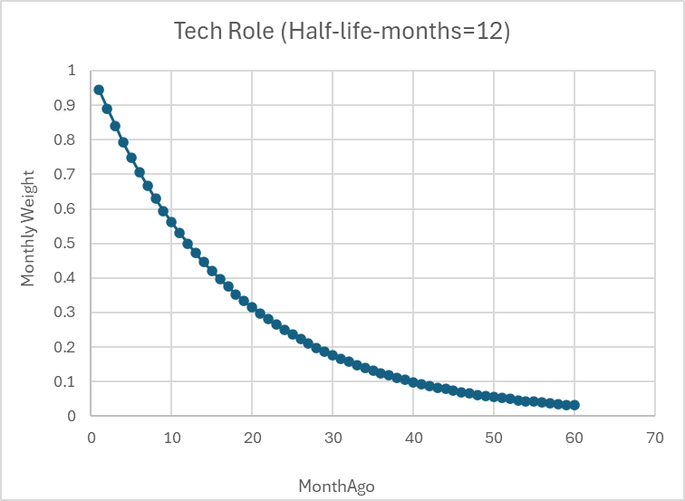
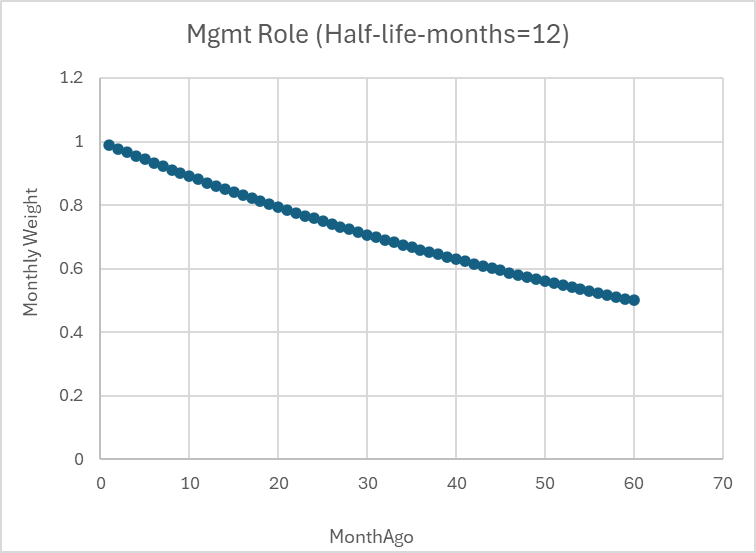

# KG‑Similarities — Knowledge Graph Pipeline (White Paper)

- Name: KG‑Similarities (knowledge‑graph driven pipeline for mining projects and companies)
- Status: Core ETL and graph import are complete; similarity analytics (project/company) and application layer are under active development
- Entry point: `install.sh`
- Audience: Data engineering, data science, knowledge graph, BI teams

## Executive Summary
- This project builds a Neo4j 5 knowledge graph around mining projects and companies, unifying multi‑source data (project JSON/CSV, geospatial shape files, Bloomberg/LinkedIn/ESG text, etc.) through ETL, entity resolution, feature engineering, and CSV generation for graph import.
- The pipeline loads a strongly‑typed schema into Neo4j (with APOC + GDS), enabling downstream search, analytics, and optional representation learning (MetaPath2Vec). 
- Similarity features (project/company) have validated prototypes (weighted Jaccard, metapath embeddings + cosine), while productized endpoints and business metrics are still in progress. The pipeline currently stops at graph import, with an optional model training step.

## Architecture Overview
- Domains
  - Project domain: project geometry, administrative areas (State/LGA), commodities, reserve scale, geologic provinces.
  - Company domain: canonical and alias names, domicile, scale/fundamentals tiers, multi‑taxonomy industry classes (ICB/GICS/BICS).
- Processing stages
  - Extraction & cleansing (ETL)
  - Geospatial enrichment and normalization (CRS alignment and spatial joins)
  - Entity resolution and name consolidation (fuzzy matching + rules + spaCy assist)
  - Graph CSV generation and Neo4j import (constraints, indices, typed nodes/edges)
  - Optional: type‑aware graph embeddings with MetaPath2Vec
- Runtime components
  - Python venv per `requirements.txt`
  - Neo4j 5 via Docker Compose (`docker-compose.yaml`), plugins: APOC, Graph Data Science
  - ETL / feature / analysis code under `src/*`
  - Optional: Streamlit app for natural‑language Cypher generation (`frontend.sh`)

## Graph Schema (Core)
- Nodes include: `Company`, `CompanyName`, `Project`, `ProjectName`, `State`, `LGA`, `Commodity`, `CommodityGroup`, `Country`, `CountryGroup`, industry classes across ICB/GICS/BICS, `ReservesScale`, etc.
- Relationships include: `OWNS`, `REFERS_TO_COMPANY`, `REFERS_TO_PROJECT`, `DOMICILED_IN`, `CLASSIFIED_AS` (multi‑taxonomy), `GROUPED_AS` (commodity grouping), `LOCATED_IN` (project→LGA→State), `CATEGORISED_AS` (project reserve tier / company scale tiers), `PART_OF` (industry and country hierarchies).
- Single source of truth for schema in code is `src/config.py` (`NODE_LABELS`, `RELATION_TYPES`). Import logic and constraints defined in `cypher/import.cypher`.

## Data & Files (defaults)
- Inputs (subset):
  - Projects: `data/raw/deposit/*` (`MineralDeposits.json`, `MajorResourceProjects.csv`, `MineView.csv`, commodity mappings, reserve/resources tables)
  - Geospatial: `data/raw/shp/*` (Province and LGA shapefiles)
  - Companies: `data/raw/company/bloomberg/*`, `data/raw/company/linkedin_unpickled/*`, `data/raw/company/modern_slavery/*`, `data/raw/company/COMPANY_202509.tsv`
- Processed & master: `data/processed/*`, `data/master/*`
- Graph CSV outputs: `data/graph/*.csv` (copied into `neo4j-docker/import` for Neo4j import)
- Central config: `src/config.py` (paths, Neo4j connection, schema, feature output paths)

## Pipeline (as implemented by install.sh)
1)  **Python environment & dependencies**
    -   Create venv and install all dependencies (spaCy en_core_web_md, PyG, GeoPandas, etc.).

2)  **Neo4j container & plugins**
    -   Pull `neo4j:5.26.12` and start with APOC & GDS enabled via `docker-compose.yaml`. Volumes map `./neo4j-docker/import` for CSV ingest. Defaults for `NEO4J_URI/USER/PASSWORD` live in `src/config.py`.

3)  **Project data processing**
    -   Source unification and normalization (`src/etl/populate_projects.py`).
    -   Geospatial enrichment (`src/feature/enrich_geospatial.py`).
    -   Graph CSV generation (`src/etl/generate_project_graph_csv.py`, `src/feature/categorise_commodity.py`, `src/feature/generate_categorise_reserves_node.py`).

4)  **Company data processing**
    -   Source construction & harmonization (`src/etl/populate_bloomberg_company.py`, `src/etl/merge_company_data.py`).
    -   Project–company name alignment and alias creation (`src/etl/match_names_json_bloomberg_linkedin.py`, `src/etl/find_former_names.py`, `src/etl/add_company_alias.py`).
    -   Graph CSV generation (`src/etl/generate_company_graph_csv.py`, `src/feature/categorise_company.py`).

5)  **Graph load (Neo4j)**
    -   Copy `data/graph/*.csv` to `neo4j-docker/import` and run `src/etl/load_cypher.py` to execute `cypher/import.cypher` (clean, constraints, node/edge imports, typed property coercions).

6)  **Optional: embeddings & similarity prototypes**
    -   Extraction: `src/analysis/create_heterodata.py` builds PyG `HeteroData`.
    -   Training: `src/analysis/train_metapath2vec.py` trains MetaPath2Vec.
    -   Similarity demos (R&D): `src/analysis/calculate_jaccard.py`, `src/analysis/calculate_cosine_similarity.py`.

## Entity Resolution & Matching Strategy
The pipeline employs a sophisticated, multi-stage strategy to resolve company entities across disparate and noisy datasets (e.g., Bloomberg, LinkedIn, Modern Slavery statements, project-listed names). The goal is to establish a canonical master company record by overcoming challenges like naming variations, legal suffixes, and the absence of universal identifiers. The process functions as a funnel, progressively refining candidates through the following stages:

1.  **Normalization and Canonicalization (`normalize_names.py`)**: This foundational step cleans and standardizes all company names to create a consistent basis for comparison. The process involves:
    -   Converting text to lowercase and standardizing characters (e.g., `&` to `and`).
    -   Stripping a comprehensive list of legal suffixes and entity types (e.g., `Pty Ltd`, `Inc`, `Corp`, `NL`).
    -   Standardizing common terms to a single form (e.g., `Resources` to `resource`, `Australia` to `au`).
    -   Filtering out generic, low-information names (e.g., "minerals") that produce poor-quality matches.

2.  **Efficient Candidate Selection (`build_word_index.py`, `select_candidates.py`)**: To avoid the computationally expensive N×M comparison between source and target datasets, an inverted index is built on the target company names. For each source name, this index rapidly retrieves a small subset of potential candidates that share at least one word. This dramatically reduces the search space, making the process scalable.

3.  **Multi-Faceted Fuzzy Scoring (`select_candidates.py`, `calculate_similarities.py`)**: Each potential candidate is subjected to a rigorous, layered scoring process:
    -   **Primary Scoring**: `rapidfuzz.WRatio` is used as the primary metric. It is robust against word reordering and partial matches, providing an initial score to filter out weak candidates (e.g., `WRatio < 80`). A standard Levenshtein ratio is used as a tie-breaker.
    -   **Secondary Scoring**: For high-potential candidates that pass the primary threshold, a vector of secondary similarity scores is calculated to provide deeper context. This is done selectively to optimize performance and includes:
        -   **Lexical Similarity**: Jaccard similarity on the sets of name tokens.
        -   **Semantic Similarity**: spaCy word vector similarity (`en_core_web_md`), which captures semantic meaning beyond simple text overlap.
        -   **Heuristic Checks**: Rule-based binary checks, such as an exact match after removing all spaces or a match after removing a country suffix (e.g., " au").

4.  **Rule-Based Match Classification (`match_rules.py`)**: The final vector of scores is fed into a decision engine that applies a cascade of rules to assign a definitive confidence status. A match is classified as high-confidence (e.g., `confident_score_match`) only if it meets stringent, multi-metric criteria (e.g., `WRatio >= 95`, `Levenshtein >= 90`, `Jaccard >= 0.5`, and `spaCy >= 0.5`).

This strategy is applied in two key contexts within the pipeline:
-   **Data Consolidation (`merge_company_data.py`)**: An "Enrich-Append" approach is used to build the master company dataset. It first attempts to enrich a primary source (Bloomberg) with data from secondary sources (Modern Slavery, LinkedIn) via high-confidence matches. Unmatched records from the secondary sources are then appended to maximize data retention.
-   **Hierarchical Entity Resolution (`match_names_json_bloomberg_linkedin.py`)**: When matching companies listed in project data to the master dataset, a hierarchical approach is used. It attempts to find a high-confidence match against the highest-quality data source (Bloomberg) first. If a match is found, the process stops. If not, it proceeds to the next source in the hierarchy (LinkedIn, then Modern Slavery), ensuring that each entity is linked to the best available record.

## MetaPath2Vec Training Method
A lightweight, focused training workflow is used to stabilize second-order similarities:
- Seed selection: companies with Project count ≥ 5 are selected (see `src/analysis/seed_companies.txt`).
- Subgraphing: a 1‑hop, type‑aware subgraph is built around seed companies along the metapaths defined in `src/feature/metapahts.json`.
- Training: MetaPath2Vec runs on the subgraph with the parameters below; `TOPK_PROJECTS=-1` keeps all connected projects.

Example (Linux, run inside the venv):
```
MP2V_SUBGRAPH=1 \
MP2V_COMPANY_IDS_FILE=src/analysis/seed_companies.txt \
MP2V_TOPK_PROJECTS=-1 \
MP2V_EPOCHS=20 \
MP2V_WALKS_PER_NODE=12 \
MP2V_WALK_LENGTH=12 \
MP2V_CONTEXT_SIZE=7 \
MP2V_DIM=128 \
MP2V_NEG=5 \
MP2V_BATCH=512 \
MP2V_K=50 \
MP2V_MAX_STEPS=800 \
MP2V_WORKERS=0 \
python src/analysis/train_metapath2vec.py
```

## Hybrid Similarity Framework
The project's similarity analytics are built on a hybrid model that combines first-order (direct neighbor) and second-order (structural context) similarities. This approach provides a nuanced score that captures both explicit shared connections and deeper, latent relationships within the knowledge graph. The final similarity score between two entities, *u* and *v*, is calculated as follows:

**Formula:**
$$
\mathrm{Sim}(u,v)=
w_1\left(\sum_{i=1}^{k}\alpha_i\frac{\lvert N_i(u)\cap N_i(v)\rvert}{\lvert N_i(u)\cup N_i(v)\rvert}\right)
+ w_2\,\cos(E_u,E_v)
$$

**Component Breakdown:**

-   **`Sim(u, v)`**: The final similarity score between entity *u* and entity *v* (e.g., two companies).
-   **`w_1`, `w_2`**: Global weights for first-order (Jaccard) and second-order (Metapath2vec) similarities, respectively. They control the overall importance of direct connections vs. contextual similarity. Typically, `w_1 + w_2 = 1`.
-   **First-Order Similarity (`∑ α_i ⋅ J_i(u, v)`)**: This is a weighted average of Jaccard similarities across *k* different dimensions (e.g., projects, commodities, geographic locations).
    -   **`α_i`**: The dimensional weight, representing the importance of the *i*-th dimension. For example, joint participation in a project might be considered more significant than producing the same common commodity. The sum of all `α_i` is typically 1.
    -   **`J_i(u, v)`**: The Jaccard similarity for the *i*-th dimension, defined as `|N_i(u) ∩ N_i(v)| / |N_i(u) ∪ N_i(v)|`, where `N_i(u)` is the set of neighbors for entity *u* in dimension *i*.
-   **Second-Order Similarity (`cos(E_u, E_v)`)**: This is the cosine similarity between the embedding vectors for entities *u* and *v*, obtained from Metapath2vec training. These vectors capture the entities' structural roles and context within the graph.

This hybrid approach allows for a flexible and powerful definition of similarity, where the influence of direct connections (like co-owning a project) and broader contextual patterns (like operating in similar geological and corporate ecosystems) can be tuned via the `w` and `α` weights.

## Experience Duration and Recency

- Extract Start Date and End Date for each experience block from the parsing API.
- Compute duration in months and months since the end date:
  $$
  D = (Y_{\text{end}}-Y_{\text{start}})\cdot 12 + (M_{\text{end}}-M_{\text{start}}) + 1,\quad
  a_{\text{end}} = (Y_{\text{now}}-Y_{\text{end}})\cdot 12 + (M_{\text{now}}-M_{\text{end}})
  $$
- Choose two parameters:
  - Maximum considered age in months: M_max (e.g., 120 months).
  - Half-life in months: H (role-specific, e.g., technical 12, managerial 60).
- Compute a per-month decay weight and aggregate, then scale the base similarity:
  - Per-month weight at age a (months):
    $$
    w(a)=
    \begin{cases}
    2^{-a/H}, & 0 \le a \le M_{\max} \\
    0, & a > M_{\max}
    \end{cases}
    $$
  - Aggregate block weight and final score:
    $$
    W=\sum_{j=0}^{D-1} w\big(a_{\text{end}}+j\big),\qquad
    S_{\text{exp}}(u,v)= W \cdot \mathrm{Sim}(u,v)
    $$

<p align="center">
  
  
</p>

Symbols:
- u, v: the two entities being compared.
- Sim(u,v): base similarity defined in the Hybrid Similarity Framework.
- D: block duration in months.
- a_end: months since the block’s end date.
- M_max: maximum age (months) considered in the weighting.
- H: half-life (months) controlling decay speed.
- w(a): weight for a month whose age is a.
- W: total weight of the block over its duration.

## API Specification

### Input Description

The API receives the following input fields for a single block of work experience to score against a target job.

| Field                    | Description                                                              |
| ------------------------ | ------------------------------------------------------------------------ |
| `target_company`         | The company of the target job (e.g., "Google", "Tencent")                |
| `target_project`         | The project, team, or functional area of the target job                  |
| `exp_block_company`      | The company from the candidate’s experience block                        |
| `exp_block_project`      | The project or work area from that experience block                      |
| `exp_block_end_monthago` | How many months ago this experience ended (recency factor)               |
| `exp_block_duration`     | Duration of this experience block in months                              |
| `half_life_decay`        | Half-life in months, controlling the speed of relevance decay            |

### Output Description

| Output Field   | Description                                                              |
| -------------- | ------------------------------------------------------------------------ |
| `similarity`   | A relevance score between 0 and 1 indicating the match to the target job. |

-   **`similarity = 0`**: Completely Unrelated
-   **`similarity = 0.5`**: Moderately Related
-   **`similarity = 1.0`**: Perfect Match

### Example

**Input:**
```json
{
  "target_company": "BHP",
  "target_project": "Yandi",
  "exp_block_company": "FMG",
  "exp_block_project": "Iron Bridge",
  "exp_block_end_monthago": 6,
  "exp_block_duration": 18,
  "half_life_decay": 48
}
```

## Roadmap (In Progress)
-   Refine second-order similarity model: Performance requires improvement through iterative hyperparameter tuning, which is computationally intensive.
-   Build API: Develop and deploy API endpoints to serve similarity scores.

## Setup & Usage
- Clone the repo, then run `./install.sh`. This script will:
  - Install dependencies, set up the Neo4j database, and run initial data processing.
  - For detailed setup, see the respective sections in this document.

## Configuration
- Connection: `NEO4J_URI`, `NEO4J_USER`, `NEO4J_PASSWORD` (env or `src/config.py` defaults)
- Training hyperparameters (override via env): `MP2V_DIM`, `MP2V_EPOCHS`, `MP2V_WALKS_PER_NODE`, etc. (see `src/analysis/train_metapath2vec.py`).
- Metapaths and weights: `src/feature/metapahts.json`.
- Weighted Jaccard config: `src/analysis/jaccard_config.json`.

## Quality Considerations & Boundaries
- Input consistency/coverage is assumed. Shapefile fields must exist (`TYPE/NAME` for Provinces; `STE_NAME21`/`LGA_NAME25` for LGA). Scripts validate and error clearly.
- Name normalization + fuzzy matching balances recall and precision; extreme abbreviations, multilingual or highly idiosyncratic aliases may need manual curation.
- Financial unit conversion and filters aim to be robust, but source methodology differences can affect rankings/tiers.
- MetaPath2Vec is tuned for CPU friendliness yet remains non‑trivial for full graphs; consider lowering epochs, walks per node, or path sampling.

## Troubleshooting
- Missing file/directory: check `src/config.py` paths and ensure `data/raw/*` sources exist.
- GeoJoin errors: verify CRS compatibility and required fields in shapefiles.
- Neo4j import errors: ensure CSVs are copied to `neo4j-docker/import` and that file names referenced in `cypher/import.cypher` exist.
- spaCy model issues: first‑time download requires internet; pre‑install in a connected environment if needed.
- Permissions: if `neo4j-docker/*` is not writable, adjust as per `install.sh` (adds permissive mode for local development).

## License & Acknowledgments
- License: see `LICENSE`
- Thanks to open‑source components: Neo4j, APOC, GDS, PyTorch Geometric, spaCy, GeoPandas, and related public datasets.

---

Notes on project status: The pipeline currently stops at graph import with an optional embedding training step. Similarity outputs and application integrations are under active development.

